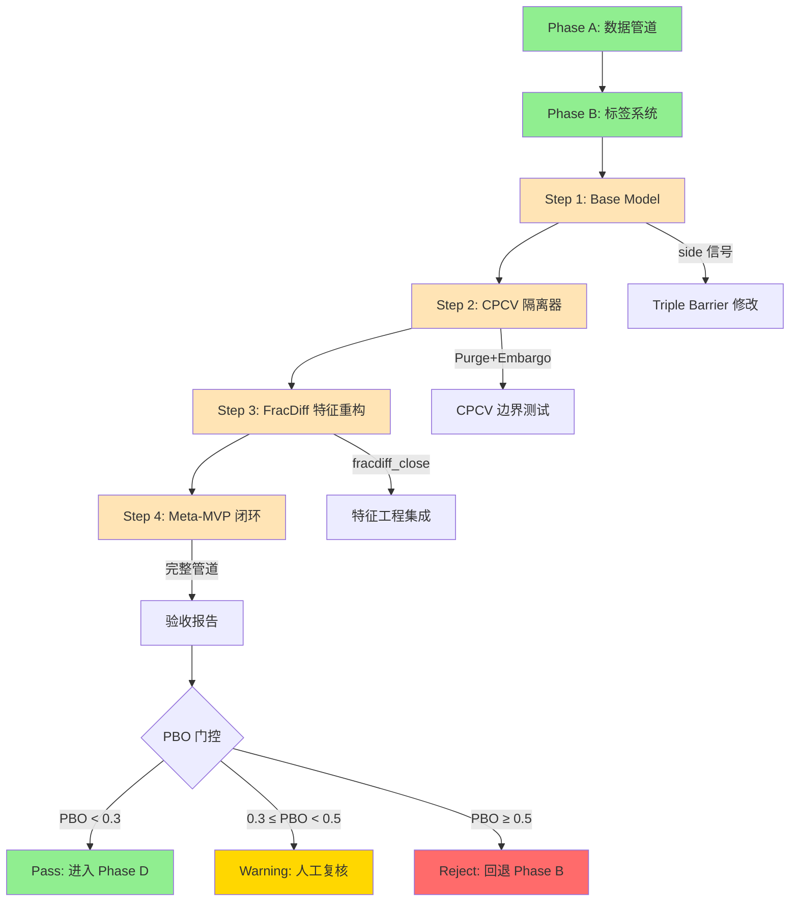

# Phase C 详细实施计划

> **制定人**: 张得功(八品领侍)
> **制定日期**: 2026-02-28
> **版本**: v1.0
> **状态**: 待审批

---

## 一、Phase C 概述

### 1.1 背景说明

Phase C 是整个量化系统的核心建模阶段,负责将特征数据转化为交易信号。根据 **OR5 审计裁决**,Phase C 已从"单模型直接预测"强制升级为 **Meta-Labeling 架构**。

**关键变更**:
- ❌ 原架构: LightGBM 直接预测涨跌方向
- ✅ 新架构: Base Model 产生信号 → LightGBM 预测"信号是否盈利" → 概率用于仓位管理

### 1.2 核心约束

以下约束为 **OR5 审计红线**,违反即一票否决:

1. **LightGBM 参数锁死**: `max_depth ≤ 3`, `num_leaves ≤ 7`, `min_data_in_leaf ≥ 200`
2. **Meta-Labeling 强制**: 不允许跳过 Base Model 直接预测
3. **FracDiff 强制**: 必须使用分数阶差分,禁止用裸价格或仅一阶差分
4. **CPCV 手写**: 禁止使用 sklearn 的 KFold 或第三方库,必须手写 Purge+Embargo
5. **数据技术债拨备**: 回测报告必须硬编码 CAGR -3%, MDD +10%

### 1.3 Phase C 总体目标

**输入** (Phase A-B 产出):
- `features.parquet`: 20 个技术特征 + 1 个 dummy_noise 哨兵特征
- `labels.parquet`: Triple Barrier 标签 (profit/loss/timeout)
- `sample_weights.parquet`: AFML 样本唯一性权重

**输出** (Phase C 产出):
- 训练好的 Meta-Labeling LightGBM 模型
- 15 条 CPCV path 的验证报告
- PBO (Probability of Backtest Overfitting) 指标
- Dummy Feature 哨兵检查报告
- 回测性能报告 (含扣减后的 CAGR/MDD)

**验收标准**:
- ✅ PBO < 0.3 (Pass) 或 0.3 ≤ PBO < 0.5 (Warning+人工复核)
- ✅ Deflated Sharpe > 0
- ✅ Dummy Feature 哨兵通过 (dummy_noise 排名 > 25%, 相对贡献 ≤ 1.0)
- ✅ 15 条 CPCV path 全部有效 (训练天数 ≥ 200)
- ✅ CPCV 边界测试通过 (无泄漏残留)
- ✅ 全部测试套件通过

---

## 二、任务拆解 (Step by Step)

### Step 1: Base Model (炮灰信号源)

**目标**: 实现极简规则策略,为每个 (symbol, date) 产生方向信号

#### 1.1 核心任务

| 编号 | 任务 | 文件 | 预计工时 | 依赖 |
|------|------|------|----------|------|
| 1.1.1 | 实现 SMA Cross Base Model | `src/signals/base_models.py` | 2h | - |
| 1.1.2 | 实现 Momentum Base Model | `src/signals/base_models.py` | 1h | 1.1.1 |
| 1.1.3 | 修改 Triple Barrier 接受 side 检查 | `src/labels/triple_barrier.py` | 1h | 1.1.1 |
| 1.1.4 | 编写 Base Model 单元测试 | `tests/test_base_models.py` | 2h | 1.1.1-1.1.3 |
| 1.1.5 | 跑通 base_model → triple_barrier 集成测试 | `tests/test_base_models.py` | 1h | 1.1.4 |

#### 1.2 技术要点

**Base Model 接口定义**:
```python
class BaseModelSMA:
    def __init__(self, fast_window=20, slow_window=60):
        self.fast_window = fast_window
        self.slow_window = slow_window
    
    def generate_signals(self, df: pd.DataFrame) -> pd.DataFrame:
        """
        输入: DataFrame (symbol, date, adj_close)
        输出: 新增 'side' 列 (+1/-1/0)
        
        side = +1: SMA20 > SMA60 (看多)
        side = -1: SMA20 < SMA60 (看空)
        side =  0: 数据不足 (冷启动)
        """
```

**防泄漏红线**:
```python
# ❌ 错误: T 日信号用了 T 日价格
sma_fast = df['adj_close'].rolling(20).mean()

# ✅ 正确: T 日信号只能用 T-1 及之前
sma_fast = df['adj_close'].shift(1).rolling(20).mean()
```

**与 Triple Barrier 对接**:
- 只有 `side != 0` 的日期才触发打标
- 标签含义转换: label=1 表示"Base Model 信号盈利", label=0 表示"信号亏损"

#### 1.3 测试清单

- [x] `test_sma_signal_no_lookahead`: 验证 shift(1)
- [x] `test_signal_values`: side ∈ {-1, 0, +1}
- [x] `test_cold_start`: 前 slow_window 天 side=0
- [x] `test_signal_with_pipeline`: base_model → triple_barrier 集成测试

#### 1.4 交付物

- `src/signals/base_models.py` (2 个 Base Model: SMA Cross + Momentum)
- `tests/test_base_models.py` (4+ 个测试)
- 全量测试通过 (112/112)

---

### Step 2: CPCV 隔离器 (PurgedKFold)

**目标**: 手写 `CombinatorialPurgedKFold`,确保训练集和验证集零信息泄漏

#### 2.1 核心任务

| 编号 | 任务 | 文件 | 预计工时 | 依赖 |
|------|------|------|----------|------|
| 2.1.1 | 实现时间线分割逻辑 | `src/models/purged_kfold.py` | 1h | Step 1 |
| 2.1.2 | 实现 Purge 算法 (基于 label_exit_date) | `src/models/purged_kfold.py` | 3h | 2.1.1 |
| 2.1.3 | 实现 Embargo 算法 (含 Feature Lookback 检查) | `src/models/purged_kfold.py` | 2h | 2.1.2 |
| 2.1.4 | 编写 CPCV 单元测试 | `tests/test_cpcv.py` | 3h | 2.1.1-2.1.3 |
| 2.1.5 | CPCV 边界测试 (泄漏检测) | `tests/test_cpcv_boundary.py` | 2h | 2.1.4 |

#### 2.2 技术要点

**CPCV 参数** (从 `config/training.yaml` 读取):
```yaml
cpcv:
  n_splits: 6           # 时间线切 6 段
  n_test_splits: 2      # 每次选 2 段做测试
  purge_window: 10      # 天 (= max_holding_days)
  embargo_window: 40    # 天
```

**组合数**: C(6,2) = 15 条 CPCV path

**Purge 算法 (精确)**:
```python
def _purge(self, train_indices, test_df, full_df):
    """
    对 train_indices 中的每个样本:
    1. 取该样本的 entry_date 和 exit_date = label_exit_date
    2. 计算 test 的特征回溯边界: test_lookback_start = test_start - 60
    3. 若 [entry_date, exit_date] 与 [test_lookback_start, test_end] 有交集:
       → 从 train 中删除
    """
```

**Embargo 算法 (含 Feature Lookback 检查)**:
```python
def _embargo(self, train_indices, test_end_date, full_df):
    """
    从 train_indices 中删除:
    - test_end 后 40 天内的样本 (基础 embargo)
    - test_end 后 40-60 天内,特征回溯穿透 test 集的样本 (额外检查)
    
    推荐方案: 使用 max(embargo_window, feature_lookback) = 60
    """
```

**⚠️ Embargo 与 Feature Lookback 的 20 天缺口**:
- 当前 `embargo_window=40 < feature_lookback=60`
- test_end 后第 41-60 天的 train 样本,其特征会回溯进入 test 集最后 19 天
- **解决方案**: 使用 `max(40, 60) = 60` 作为实际 embargo 值

#### 2.3 自证方法

实现完成后,必须能输出以下日志:
```
CPCV Path 1/15: Test=[fold_2, fold_5]
  Test range: 2021-03-15 ~ 2021-09-30
  Train before purge: 2847 samples
  Purged: 312 samples (overlap with test label periods)
  Embargoed: 89 samples (within 60d after test end)
  Train after purge: 2446 samples (effective 487 days)
  ✅ Valid (>= 200 days)
```

#### 2.4 测试清单

- [x] `test_no_temporal_overlap`: 验证 train 和 test 无时间交集
- [x] `test_purge_removes_overlapping_labels`: 模拟已知重叠,确认被删除
- [x] `test_embargo_gap`: 验证 test_end 后 60 天内无 train 样本
- [x] `test_all_paths_valid`: 15 条 path 有效训练天数均 ≥ 200
- [x] `test_purge_uses_real_exit_date`: 确认使用 label_exit_date

#### 2.5 交付物

- `src/models/purged_kfold.py`
- `tests/test_cpcv.py` (5+ 个测试)
- `tests/test_cpcv_boundary.py` (新增,边界测试)
- 15 条 CPCV path 全部有效

---

### Step 3: FracDiff 特征重构

**目标**: 用分数阶差分替代对数收益率,在保持平稳性的同时保留时序记忆

#### 3.1 核心任务

| 编号 | 任务 | 文件 | 预计工时 | 依赖 |
|------|------|------|----------|------|
| 3.1.1 | 实现 Fixed-Window FracDiff 算法 | `src/features/fracdiff.py` | 2h | Step 2 |
| 3.1.2 | 实现 ADF 检验 + 最优 d 搜索 | `src/features/fracdiff.py` | 2h | 3.1.1 |
| 3.1.3 | 集成到 build_features | `src/features/build_features.py` | 1h | 3.1.2 |
| 3.1.4 | 编写 FracDiff 单元测试 | `tests/test_fracdiff.py` | 2h | 3.1.1-3.1.3 |

#### 3.2 技术要点

**FracDiff 算法**:
```python
def fracdiff_fixed_window(series: pd.Series, d: float, window: int = 100) -> pd.Series:
    """
    固定窗口分数阶差分
    
    weights[0] = 1
    weights[k] = weights[k-1] * (d - k + 1) / k    (k = 1, 2, ..., window-1)
    fracdiff[t] = sum(weights[k] * series[t-k] for k in range(window))
    
    返回: 差分后的序列 (前 window-1 个值为 NaN)
    """
```

**最优 d 搜索**:
```python
def find_optimal_d(series: pd.Series, d_range=np.arange(0.0, 1.05, 0.05)):
    """
    二分法/网格搜索找最小 d,使 ADF 检验 p < 0.05
    
    关键约束:
    - 必须只在 TRAIN 集上运行 (不能用 test 数据拟合 d)
    - 返回满足平稳性的最小 d (保留最大记忆)
    
    美股日频最优 d 通常在 0.35 ~ 0.65
    """
```

**⚠️ Burn-in 与 CPCV 断层的正确衔接**:

这是一个极易踩的工程陷阱:

**❌ 错误做法**: 先 CPCV 切分出 Train 集 → 再在 Train 集上算 FracDiff

问题: CPCV 的 Purge+Embargo 会在时间轴上挖出空洞,每个断层都会导致 FracDiff 前 100 天变成 NaN

**✅ 正确做法**: 两步分离
1. **预计算**: 在全量时间轴上预计算所有候选 d 值的 FracDiff 列 (纯因果运算,不构成泄漏)
2. **隔离**: CPCV 切分后,ADF 检验找最优 d 时只看 Train 的 index
3. **使用**: 用 optimal_d 对应的预计算列作为该 fold 的特征

#### 3.3 测试清单

- [x] `test_d_zero_is_original`: FracDiff(d=0) ≈ 原序列
- [x] `test_d_one_is_diff`: FracDiff(d=1) ≈ 一阶差分
- [x] `test_optimal_d_stationary`: 找到的 d 使 ADF p < 0.05
- [x] `test_memory_preserved`: d < 1 时,与原序列相关性 > 0
- [x] `test_no_future_leakage`: FracDiff[t] 只使用 t 及之前的数据

#### 3.4 交付物

- `src/features/fracdiff.py`
- `tests/test_fracdiff.py` (5+ 个测试)
- 新增特征列 `fracdiff_close`

---

### Step 4: Meta-MVP 闭环

**目标**: 将前 3 步的所有组件串联成完整的训练-验证-输出管道

#### 4.1 核心任务

| 编号 | 任务 | 文件 | 预计工时 | 依赖 |
|------|------|------|----------|------|
| 4.1.1 | 实现 MetaTrainer 主类 | `src/models/meta_trainer.py` | 3h | Step 1-3 |
| 4.1.2 | 集成 LightGBM (从 training.yaml 读参) | `src/models/meta_trainer.py` | 1h | 4.1.1 |
| 4.1.3 | 实现 Dummy Feature 哨兵检查 | `src/models/meta_trainer.py` | 1h | 4.1.2 |
| 4.1.4 | 实现 PBO 计算 | `src/models/meta_trainer.py` | 2h | 4.1.2 |
| 4.1.5 | 实现回测报告生成 (含扣减) | `src/models/meta_trainer.py` | 2h | 4.1.4 |
| 4.1.6 | 编写 MetaTrainer 单元测试 | `tests/test_meta_trainer.py` | 3h | 4.1.1-4.1.5 |

#### 4.2 技术要点

**MetaTrainer 完整流程**:
```
1. 加载 Phase A-B 产出的特征+标签数据
2. Base Model 生成方向信号 side
3. 过滤: 只保留 side != 0 的样本
4. 标签转换: {profit → 1, loss → 0} (Meta-Label: 信号是否盈利)
5. 对每个 CPCV fold:
   a. 在 train 集上用二分法找最优 FracDiff d
   b. 用该 d 值计算 train 和 test 的 FracDiff 特征
   c. 训练 LightGBM (从 training.yaml 读参数)
   d. 在 test 集上预测概率 p
6. 汇总 15 条 path 的结果
7. 输出: 概率校准曲线、AUC、PBO 估计
```

**LightGBM 参数处理** (OR5-CODE T5):
```python
import yaml

with open('config/training.yaml') as f:
    cfg = yaml.safe_load(f)

lgb_params = cfg['lightgbm'].copy()

# ⚠️ 必须从 params dict 中 .pop() 出来
n_estimators = lgb_params.pop('n_estimators', 500)
early_stopping_rounds = lgb_params.pop('early_stopping_rounds', 50)

# lgb_params 现在只包含模型超参 (OR5 硬化参数)
model = lgb.train(
    lgb_params,
    train_data,
    num_boost_round=n_estimators,
    callbacks=[lgb.early_stopping(early_stopping_rounds)]
)
```

**哨兵检查**:

1. **Dummy Feature Sentinel**:
```python
importance = model.feature_importance(importance_type='gain')
dummy_rank = ...  # dummy_noise 的排名

# 判定标准 (plan_v4_patch.md 补丁 2):
if dummy_rank <= len(features) * 0.25:
    raise ValueError("Overfitting detected: dummy_noise in top 25%")
    
if dummy_gain / median_real_feature_gain > 1.0:
    raise ValueError("Overfitting detected: dummy more important than median")
```

2. **PBO 门控**:
```python
pbo = calculate_pbo(path_results)

if pbo >= 0.5:
    raise ValueError(f"HARD REJECT: PBO={pbo:.2f} >= 0.5")
elif pbo >= 0.3:
    logger.warning(f"PBO WARNING: {pbo:.2f} in [0.3, 0.5) — requires manual review")
    report['pbo_warning'] = True  # 报告中必须标红
```

**回测报告扣减** (硬编码):
```python
SURVIVORSHIP_CAGR_PENALTY = 0.02
LOOKAHEAD_CAGR_PENALTY = 0.01
MDD_INFLATION = 0.10

report['adjusted_cagr'] = report['raw_cagr'] - 0.03  # 2% + 1%
report['adjusted_mdd'] = report['raw_mdd'] + 0.10

# 展示时必须用 adjusted 值
```

#### 4.3 测试清单

- [x] `test_full_pipeline_runs`: 合成数据跑通完整流程
- [x] `test_meta_label_binary`: 标签只有 0 和 1
- [x] `test_sample_weight_passed`: LGB 接收到 sample_weight
- [x] `test_dummy_sentinel_catches_overfit`: 人造过拟合场景触发哨兵
- [x] `test_cpcv_15_paths`: 确认产出 15 条 path
- [x] `test_lgb_params_from_config`: 参数从 YAML 读取

#### 4.4 交付物

- `src/models/meta_trainer.py`
- `tests/test_meta_trainer.py` (6+ 个测试)
- 15 条 CPCV path 验证报告
- PBO 报告 (含门控判定)
- Dummy Feature 哨兵报告
- 回测性能报告 (含扣减后的 CAGR/MDD)
- 全量测试通过

---

## 三、依赖关系图



### 3.1 关键依赖说明

| 依赖关系 | 说明 | 阻断条件 |
|----------|------|----------|
| Step 1 → Step 2 | Base Model 产生 side 后,CPCV 才能基于 side != 0 的样本分割 | side 未生成或全为 0 |
| Step 2 → Step 3 | CPCV 切分后,才能在每个 fold 的 Train 集上拟合 FracDiff 的 d 值 | CPCV 未切分或 path 无效 |
| Step 3 → Step 4 | FracDiff 特征计算完成后,MetaTrainer 才能训练完整管道 | FracDiff 特征缺失或 ADF 不平稳 |
| Step 4 → 验收 | MetaTrainer 输出 PBO 后,才能判定是否通过 Phase C | PBO ≥ 0.5 (Hard Reject) |

### 3.2 可并行任务

以下任务可以在各自 Step 内并行:

- **Step 1**: SMA Cross 和 Momentum 两个 Base Model 可并行实现
- **Step 2**: Purge 算法和 Embargo 算法可并行编写 (需先完成时间线分割)
- **Step 3**: FracDiff 算法和 ADF 检验可并行编写 (需先确定接口)

---

## 四、验收标准

### 4.1 功能验收

| 编号 | 验收项 | 通过标准 | 检查方式 |
|------|--------|----------|----------|
| F1 | Base Model 信号生成 | side ∈ {-1, 0, +1},无前视泄漏 | `test_sma_signal_no_lookahead` 通过 |
| F2 | CPCV 隔离有效 | 15 条 path 全部有效 (≥ 200 天训练数据) | `test_all_paths_valid` 通过 |
| F3 | CPCV 无泄漏 | train/test 无时间交集,Embargo 覆盖 Feature Lookback | `test_cpcv_boundary.py` 通过 |
| F4 | FracDiff 平稳 | ADF p < 0.05 且保留记忆 (与原序列相关性 > 0) | `test_optimal_d_stationary` 通过 |
| F5 | Meta-Labeling 管道 | 15 path 完整运行,输出概率向量 | `test_full_pipeline_runs` 通过 |
| F6 | LightGBM 参数合规 | 从 training.yaml 读取,OR5 硬化参数未被修改 | `test_lgb_params_from_config` 通过 |

### 4.2 性能验收

| 编号 | 验收项 | 通过标准 | 门控等级 |
|------|--------|----------|----------|
| P1 | PBO (Probability of Backtest Overfitting) | PBO < 0.3 | **Pass** |
| P2 | PBO (Warning 区间) | 0.3 ≤ PBO < 0.5 | **Warning** (允许继续,需人工复核) |
| P3 | PBO (Reject 区间) | PBO ≥ 0.5 | **Hard Reject** (回退 Phase B) |
| P4 | Deflated Sharpe Ratio | DSR > 0 | **Pass** |
| P5 | Dummy Feature 哨兵 | 排名 > 25% 且 相对贡献 ≤ 1.0 | **Pass** |
| P6 | 策略 vs SPY 基准 | 风险调整后收益优于 SPY | **Pass** |

### 4.3 代码质量验收

| 编号 | 验收项 | 通过标准 |
|------|--------|----------|
| Q1 | 全量测试通过 | `pytest tests/` → 100% 通过 |
| Q2 | 代码覆盖率 | 关键模块覆盖率 ≥ 80% |
| Q3 | 无硬编码参数 | 所有参数从 config/ 读取 |
| Q4 | 事件日志完整 | 每个操作写入 append-only 日志 |
| Q5 | 幂等性保证 | 中断重启不产生副作用 |

### 4.4 文档验收

| 编号 | 验收项 | 交付物 |
|------|--------|--------|
| D1 | CPCV 验证报告 | `reports/cpcv_validation.md` |
| D2 | PBO 分析报告 | `reports/pbo_analysis.md` |
| D3 | Dummy Feature 哨兵报告 | `reports/dummy_sentinel.md` |
| D4 | 回测性能报告 | `reports/backtest_performance.md` (含扣减后指标) |
| D5 | Phase C 完成总结 | `docs/PHASE_C_SUMMARY.md` |

---

## 五、时间估算

### 5.1 总体时间

| 阶段 | 预计工时 | 日历天数 | 备注 |
|------|----------|----------|------|
| Step 1: Base Model | 7h | 1 天 | 含测试和集成 |
| Step 2: CPCV 隔离器 | 11h | 1.5 天 | 最复杂模块,需仔细测试 |
| Step 3: FracDiff 特征重构 | 7h | 1 天 | 含 Burn-in 衔接 |
| Step 4: Meta-MVP 闭环 | 12h | 1.5 天 | 集成所有组件 |
| **总计** | **37h** | **5 天** | 按 7-8h/天计算 |

### 5.2 详细时间分解

#### Step 1: Base Model (7h)

| 任务 | 预计工时 | 风险系数 | 调整后工时 |
|------|----------|----------|------------|
| 实现 SMA Cross Base Model | 2h | 1.2 | 2.4h |
| 实现 Momentum Base Model | 1h | 1.1 | 1.1h |
| 修改 Triple Barrier | 1h | 1.3 | 1.3h |
| 编写单元测试 | 2h | 1.2 | 2.4h |
| **小计** | **7h** | - | **7.2h** |

#### Step 2: CPCV 隔离器 (11h)

| 任务 | 预计工时 | 风险系数 | 调整后工时 |
|------|----------|----------|------------|
| 实现时间线分割逻辑 | 1h | 1.1 | 1.1h |
| 实现 Purge 算法 | 3h | 1.5 | 4.5h |
| 实现 Embargo 算法 (含 Feature Lookback) | 2h | 1.4 | 2.8h |
| 编写单元测试 | 3h | 1.3 | 3.9h |
| CPCV 边界测试 | 2h | 1.2 | 2.4h |
| **小计** | **11h** | - | **14.7h** |

#### Step 3: FracDiff 特征重构 (7h)

| 任务 | 预计工时 | 风险系数 | 调整后工时 |
|------|----------|----------|------------|
| 实现 FracDiff 算法 | 2h | 1.3 | 2.6h |
| 实现 ADF 检验 + 最优 d 搜索 | 2h | 1.4 | 2.8h |
| 集成到 build_features | 1h | 1.5 | 1.5h |
| 编写单元测试 | 2h | 1.2 | 2.4h |
| **小计** | **7h** | - | **9.3h** |

#### Step 4: Meta-MVP 闭环 (12h)

| 任务 | 预计工时 | 风险系数 | 调整后工时 |
|------|----------|----------|------------|
| 实现 MetaTrainer 主类 | 3h | 1.3 | 3.9h |
| 集成 LightGBM | 1h | 1.2 | 1.2h |
| 实现 Dummy Feature 哨兵 | 1h | 1.1 | 1.1h |
| 实现 PBO 计算 | 2h | 1.4 | 2.8h |
| 实现回测报告生成 | 2h | 1.2 | 2.4h |
| 编写单元测试 | 3h | 1.3 | 3.9h |
| **小计** | **12h** | - | **15.3h** |

### 5.3 风险缓冲

- **基础估算**: 37h (5 天)
- **风险系数调整后**: 46.5h (约 6.5 天)
- **建议缓冲**: +20% → **56h (约 8 天)**

**建议排期**: 7-8 个工作日 (含缓冲)

---

## 六、风险与应对

### 6.1 技术风险

| 风险 | 概率 | 影响 | 应对措施 |
|------|------|------|----------|
| CPCV Purge 后训练数据不足 | 中 | 高 | 降低 embargo_window 或增加数据量 |
| FracDiff ADF 不平稳 | 低 | 中 | 增大 d 值或增大窗口 |
| LightGBM AUC ≈ 0.50 | 高 | 低 | 日频美股信噪比低,0.52 即可接受 |
| PBO ≥ 0.3 | 中 | 高 | 检查特征质量,增加正则化 |
| Dummy Feature 进入 top 25% | 低 | 高 | 回查特征,拒绝当前模型 |
| Embargo 断层烧毁大量数据 | 中 | 中 | 使用预计算 FracDiff + 只在 Train 上拟合 d |

### 6.2 流程风险

| 风险 | 概率 | 影响 | 应对措施 |
|------|------|------|----------|
| Step 顺序颠倒 | 低 | 高 | 严格执行 Step 1→2→3→4,禁止跳步 |
| 测试覆盖不足 | 中 | 中 | 每个 Step 完成后跑全量测试 |
| 参数硬编码 | 低 | 中 | Code Review 检查,从 config/ 读取 |
| 事件日志缺失 | 低 | 中 | 每个操作必须写入日志 |
| 中断后幂等性失效 | 中 | 高 | 幂等性测试 + 检查点机制 |

### 6.3 回退策略

| 场景 | 触发条件 | 回退操作 |
|------|----------|----------|
| PBO ≥ 0.5 | Hard Reject | 回退到 Phase B 重新调整特征/标签 |
| Dummy Feature 哨兵触发 | 过拟合确认 | 拒绝当前模型,回查特征 |
| CPCV path 大量无效 | 训练数据不足 | 降低 embargo 或增加数据量 |
| 数据泄漏检测失败 | test_no_leakage 失败 | 回退到 Phase A 修复数据合约 |

---

## 七、执行建议

### 7.1 每日检查点

每个 Step 完成后必须执行:

1. **全量测试**: `pytest tests/ -v` → 100% 通过
2. **Git Commit**: 提交代码,commit message 包含 Step 编号
3. **事件日志**: 确认操作已写入日志
4. **文档更新**: 更新 PHASE_C_SUMMARY.md 的进度

### 7.2 里程碑检查

| 里程碑 | 完成标志 | 验证方式 |
|--------|----------|----------|
| Step 1 完成 | base_model → triple_barrier 跑通 | `test_signal_with_pipeline` 通过 |
| Step 2 完成 | 15 条 CPCV path 全部有效 | `test_all_paths_valid` 通过 |
| Step 3 完成 | FracDiff ADF p < 0.05 | `test_optimal_d_stationary` 通过 |
| Step 4 完成 | PBO < 0.3 (或 Warning) + 哨兵通过 | MetaTrainer 验收报告 |

### 7.3 关键决策点

| 决策点 | 触发条件 | 决策选项 |
|--------|----------|----------|
| PBO 门控判定 | Step 4 完成后 | PBO < 0.3 → Pass / 0.3-0.5 → Warning+复核 / ≥ 0.5 → Reject |
| Embargo 方案选择 | Step 2 开工时 | 选项 A (简单,embargo=60) 或 选项 B (精确,保留数据) |
| 集成模型决策 | Phase C 完成后 | 若集成优于单模型 → 进入 Phase C+ / 否则 → 直接进入 Phase D |

---

## 八、交付清单

### 8.1 代码交付物

- [ ] `src/signals/base_models.py` (2 个 Base Model)
- [ ] `src/models/purged_kfold.py` (CPCV 隔离器)
- [ ] `src/features/fracdiff.py` (FracDiff 特征)
- [ ] `src/models/meta_trainer.py` (Meta-MVP 闭环)
- [ ] `src/labels/triple_barrier.py` (修改: 接受 side 检查)

### 8.2 测试交付物

- [ ] `tests/test_base_models.py` (4+ 个测试)
- [ ] `tests/test_cpcv.py` (5+ 个测试)
- [ ] `tests/test_cpcv_boundary.py` (新增: 边界测试)
- [ ] `tests/test_fracdiff.py` (5+ 个测试)
- [ ] `tests/test_meta_trainer.py` (6+ 个测试)

### 8.3 文档交付物

- [ ] `reports/cpcv_validation.md` (CPCV 验证报告)
- [ ] `reports/pbo_analysis.md` (PBO 分析报告)
- [ ] `reports/dummy_sentinel.md` (Dummy Feature 哨兵报告)
- [ ] `reports/backtest_performance.md` (回测性能报告,含扣减)
- [ ] `docs/PHASE_C_SUMMARY.md` (Phase C 完成总结)

### 8.4 模型交付物

- [ ] 训练好的 Meta-Labeling LightGBM 模型 (`.joblib`)
- [ ] 15 条 CPCV path 的验证结果 (`.json`)
- [ ] 特征重要性排名 (`.csv`)
- [ ] 概率校准曲线 (`.png`)

---

## 九、附录

### 9.1 参考文档

- `plan.md` v4.2 - OR5 审计裁决版 (项目总计划)
- `plan_v4_patch.md` (执行层补丁)
- `docs/PHASE_C_IMPL_GUIDE.md` (工程实施指南)
- `docs/OR5_CONTRACT.md` (审计契约)
- `config/training.yaml` (LightGBM 参数配置)
- `config/event_protocol.yaml` (事件生成协议)

### 9.2 关键联系人

- **项目总管**: 李成荣 (六品总管) - 监督、汇报、审批
- **工程实施**: 李得勤 (八品领侍) - 编程实现
- **规划制定**: 张得功 (八品领侍) - 本文档制定人

### 9.3 术语表

| 术语 | 全称 | 说明 |
|------|------|------|
| CPCV | Combinatorial Purged Cross-Validation | 组合清除交叉验证 |
| PBO | Probability of Backtest Overfitting | 回测过拟合概率 |
| FracDiff | Fractional Differencing | 分数阶差分 |
| ADF | Augmented Dickey-Fuller Test | 增强迪基-富勒检验 (平稳性检验) |
| Meta-Labeling | Meta-Labeling | 元标签 (预测信号质量的二阶模型) |
| Purge | Purge | 清除 (删除训练集中与验证集有重叠的样本) |
| Embargo | Embargo | 禁运 (验证集结束后一段时间内的训练样本也删除) |
| PIT | Point-in-Time | 时点数据 (禁止偷看未来) |
| AFML | Advances in Financial Machine Learning | 金融机器学习进展 (参考书籍) |

---

**文档状态**: ✅ 已完成,待主子审批

**下一步**: 提交给李公公(总管)审核,批准后交由李得勤(工程)执行

---

*张得功 敬上*
*2026-02-28*
