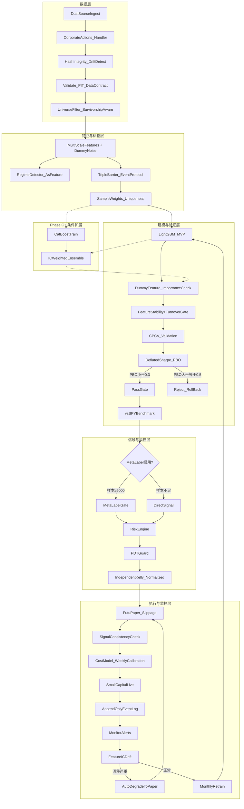

# 美股日频量化MVP执行计划 v4.1 (Futu版)

## 修订历史

- **v1**：初版。
- **v2**：新增数据合约、事件生成协议、单模型先行、Meta-Labeling 条件化、成本校准闭环、模型换代门控。
- **v3**：新增 Hash 冻结 + 漂移检测、成本模型参数口径、成分变更日规则、Kelly 病态防护、三条高价值验收项、Agent 防御性原则。
- **v4**：最终打磨，主要变更：
  1. **测试确定性**：单元测试强制使用静态 Mock Data，禁止网络依赖（§14）。
  2. **Agent 上下文保护**：`.claudeignore` / `.cursorignore` 隔离大文件（§14）。
  3. **每日流水线幂等性**：中断重启不产生副作用（§10 + Phase E）。
  4. **Dummy Feature 噪声哨兵**：与时间打乱哨兵互补的第二道过拟合检测（Phase B/C）。
  5. **Hash 覆盖 RawClose + 隐含调整因子**：堵住拆股识别链路的审计盲区（§3.5）。
  6. **漂移阈值 universe 自适应**：`max(10, 1% × UniverseSize)`（§3.5）。
  7. **幸存者偏差改为区间估算**（§3）。
  8. **成分变更日从数据源取实际生效日期**（§3）。
  9. **信号不一致分类字段**：加速 debug（Phase E）。
  10. **补充测试项**：CPCV 边界测试、成本校准稳定性测试、漂移检测回归测试。
- **v4.1**：执行层迁移 Alpaca → Futu OpenAPI。主要变更：
  1. **交易执行从 Alpaca API 切换到 Futu OpenAPI**（futu-api Python SDK + FutuOpenD 网关）。
  2. **数据采集保持 yfinance 主源不变**，Futu 行情作为第三备源 + 实时 bid/ask 数据源。
  3. **成本模型参数调整**（Futu 佣金结构 vs Alpaca 零佣金）。
  4. **Docker 部署适配 FutuOpenD 网关**。
  5. **模拟盘策略调整**（Futu 模拟交易的差异处理）。

---

## 1) 项目定位

- 目标：构建"数据 -> 特征 -> 标签 -> 模型 -> 验证 -> 模拟盘 -> 小资金实盘 -> 复盘重训"的可运行闭环。
- 盈利定位：稳定性优先，目标覆盖运行成本。不追求短期高收益。
- 约束：仅美股、仅日频、最多 2 个策略、低成本技术栈。
- 原则：
  - 防过拟合优先于追求高 Sharpe。
  - 先风控再收益。
  - 先可复现再扩展。
  - 每个决策必须可解释、可回溯。
  - 先单模型跑通全链路，再扩展集成。

---

## 2) 范围

### In Scope

- 双数据源容灾采集（主 yfinance / 备 Tiingo 或 Alpha Vantage）。
- **Futu OpenAPI 作为第三备源 + 实时行情源**（v4.1 新增）。
- Point-in-Time 数据管理 + 幸存者偏差处理。
- 数据合约（Data Contract）：复权、分红、公司行为、可交易性定义。
- 数据历史漂移检测 + Hash 冻结机制。
- 多时间尺度特征工程（日/周/月回看窗口）。
- 事件生成协议：Triple Barrier 事件定义 + 并发规则。
- Triple Barrier 标签 + 样本唯一性加权 + 类不平衡处理。
- LightGBM 单模型（MVP 主线）+ CatBoost 双模型集成（条件扩展 Phase C+）。
- Meta-Labeling 信号过滤（条件启用，Phase D 前置条件验证后决定）。
- CPCV + Walk-Forward 双重验证。
- Deflated Sharpe Ratio + PBO 过拟合检测。
- 双重过拟合哨兵：时间打乱哨兵 + Dummy Feature 噪声哨兵（v4 扩展）。
- 轻量级 Regime Detector（作为特征输入，非硬风控驱动）。
- Fractional Kelly 多维仓位管理（MVP 阶段使用独立 Kelly + 总量归一化）。
- 多层风控闸门（含 Kill-Switch + 自动降级到模拟盘）。
- 模型换代门控：Feature Stability Gate + Turnover/Exposure Gate。
- 成本模型周度校准闭环（含固定参数口径 schema）。
- PDT 合规守卫。
- 结构化 append-only 事件日志。
- **Futu OpenAPI 模拟盘**（含显式滑点模型）+ 小资金实盘（v4.1 变更）。
- SPY buy-and-hold 基准对比。
- 模型重训、特征漂移监控、版本管理、告警。
- 每日流水线幂等性保证（v4 新增）。
- 全流程测试 + Docker 化。

### Out of Scope

- 分钟级 / 高频策略。
- RL 实盘决策。
- LLM 自动因子挖掘。
- 多市场并行。
- 深度学习模型（LSTM / Transformer），留作升级路径。
- 横截面特征（行业内 Z-score 等）、HRP 组合优化、Market Impact Model——记录于升级路径。

---

## 3) 股票池

- 初始池：S&P 500 成分股。
- 幸存者偏差处理：
  - **MVP 采用方案 B**：使用当前成分，但在回测报告中附加幸存者偏差区间估算（v4 修正为区间）：
    - 平稳期：年化收益扣减 1%~2%，MDD 放大 10%~15%。
    - 高波动/危机期（VIX 月均 > 25）：年化收益扣减 2%~4%，MDD 放大 15%~25%。
    - 报告中按回测区间内的实际 regime 分布加权披露。
  - 方案 A（升级路径）：使用历史 Point-in-Time 成分表（付费数据源），回测时仅使用当时的真实成分。注意：Wikipedia 历史编辑作为 PIT 成分来源不稳定，不推荐。
- 筛选过滤：剔除日均成交额 < $5M、上市不足 2 年的标的。
- 更新频率：每季度同步调整。
- 成分变更日处理规则：
  - **变更日判定**（v4 修正）：以数据源或公开披露的 **实际生效日期** 为准，不硬编码"第三个周五"。若暂时无法自动获取，手动录入并记录进事件日志，确保可追溯。
  - **新纳入标的冷启动**：新成分需在系统中积累 ≥ `min_history_days`（默认 60 个交易日）的特征数据后，方可纳入信号生成。冷启动期间仅采集数据、不生成信号。
  - **剔除标的持仓迁移**：若持仓标的被移出成分，次日开盘以限价单退出（限价 = 前收盘价 × 0.995）。若当日未成交，改市价单强制退出。退出事件写入事件日志，标注原因"成分剔除"。
  - **变更日信号冻结**：成分调整生效日当日不生成新开仓信号，仅处理退出。
- PDT 合规约束：仓位持有不少于 1 个交易日（隔夜持仓），严禁同日买入并卖出同一标的。
- 配置文件：`config/universe.yaml`。

  ```yaml
  # config/universe.yaml 关键字段
  min_history_days: 60           # 新成分冷启动最小天数
  min_adv_usd: 5_000_000         # 最低日均成交额
  min_listing_years: 2            # 最低上市年限
  rebalance_frequency: quarterly  # 成分同步频率
  rebalance_date_source: "manual" # "manual" | "auto"（升级后自动从数据源获取）
  exit_limit_slippage: 0.005      # 剔除标的限价退出容忍滑点
  ```

### 3.5) 数据合约（Data Contract）

> 本节定义全系统共用的数据口径，所有模块必须遵守。违反此合约等价于数据泄漏，触发回退到 Phase A。

**价格字段**：

- 使用 **Adjusted Close（复权收盘价）**，复权方式为 **前复权（backward-adjusted）**，包含拆股 + 分红调整。
- OHLC 全部使用前复权值（yfinance 默认行为）。如备源不提供复权 OHLC，**禁用所有依赖 OHLC 的特征**（ATR、K 线形态等），仅保留基于 AdjClose 和 Volume 的特征（详见 patch 1）。
- **原始（Raw）价格**仅用于：成交额计算（Raw Close × Volume）、滑点/成本模型（基于实际交易价格）、拆股识别（Raw vs Adj 对比）。

**收益率**：

- 统一使用 **对数收益率**：`r_t = ln(AdjClose_t / AdjClose_{t-1})`。
- 收益率隐含分红再投资（因 Adj Close 已包含分红调整）。

**公司行为（Corporate Actions）处理**：

| 事件 | 处理方式 |
|------|---------|
| 拆股（Split） | yfinance 自动反映在 Adj Close 中；异常跳变检测需先排除拆股再判断（对比 Raw Close 变化 vs Adj Close 变化） |
| 分红（Dividend） | 已包含在 Adj Close 中；不单独建模 |
| 退市（Delisting） | 标记最后交易日，该日之后数据置 NaN；回测中退市标的在最后交易日强制平仓，按最后成交价结算。报告中披露"按退市强平"的处理方式 |
| 停牌（Suspension） | 停牌期间数据置 NaN，不生成特征/标签；复牌后需≥5 个交易日数据才可重新纳入信号生成 |
| 合并/收购 | 等同退市处理（被收购方），收购方按正常标的继续。报告中披露简化假设（实际可能涉及 ticker 变更、现金+换股、并表等复杂情况） |

**PIT 约束**：

- 价格数据：通过 Hash 冻结机制实现可验证 PIT（见下方"数据历史漂移检测"）。
- 股票池成分：MVP 阶段使用当前成分（见 §3 方案 B），已披露偏差。
- 公司行为信息：假设拆股/分红信息在 Ex-Date 当日可得（保守假设）。

**数据历史漂移检测 + Hash 冻结**：

> yfinance 等免费数据源的上游可能追溯修正历史调整因子。虽不频繁，但一旦发生会破坏可复现性。

- **落库 Hash**：每次数据入库后，按 `(symbol, date)` 粒度对以下字段计算 content hash，存入 `data/processed/integrity_hashes.parquet`：
  - **Adj 字段**：AdjClose, AdjOpen, AdjHigh, AdjLow, Volume
  - **Raw 字段**：RawClose（v4 新增，因拆股识别和成交额计算依赖 Raw）
  - **隐含调整因子**：`adj_factor = AdjClose / RawClose`（v4 新增，能单独捕捉"只改了调整因子"的漂移）
- **每日漂移检测**：每次 re-ingest 时，对已有历史数据区间重新计算 hash，与存储的 hash 对比。
  - 若 **单标的单日** 变动：写入事件日志（level=WARN），不阻塞流程。
  - 若 **同一标的连续 ≥ 5 日** 变动：写入事件日志（level=ERROR），触发冻结 + 人工确认。
  - 若 **同一日变动标的数 ≥ max(10, 1% × 当前 UniverseSize)**：写入事件日志（level=ERROR），触发冻结 + 人工确认（v4 修正为 universe 自适应阈值）。
  - 冻结 = 暂停该标的/该批次信号生成，等待确认后决定接受新数据或回退。
- **回测复现保障**：回测固定使用某次快照的 Parquet 文件。若需更新历史数据，生成新快照并记录版本号，旧快照保留不删除（存放于 `data/snapshots/`）。

**缺失值策略**：

- 单日缺失：前向填充（forward-fill），并在事件日志中记录。
- 连续缺失 ≥ 3 日：不填充，标记为停牌处理。
- 特征计算遇到 NaN：该标的该日不生成信号（跳过，不强行填充）。

**异常跳变检测修正**：

- 原规则"日涨跌幅 > 50%"需先排除公司行为：
  - 若 Raw Close 变化 > 50% 但 Adj Close 变化 < 5%，判定为拆股，非异常。
  - 若 Adj Close 变化 > 50%，标记为异常，人工审核后决定保留/剔除。

---

## 4) 技术栈

- 语言：Python 3.11+
- 数据采集：yfinance（主）、tiingo 或 alpha_vantage（备）
- **实时行情：Futu OpenAPI**（v4.1 新增，获取实时 bid/ask）
- 数据存储：DuckDB + Parquet
- 特征工程：pandas、ta-lib、numpy
- 建模：lightgbm（MVP 主线）、catboost（Phase C+ 条件扩展）、scikit-learn
  - training.yaml 预留 XGBoost 接口，可在遇到过拟合瓶颈时热插拔对比，无需修改架构。
- 验证：自实现 CPCV（参考 skfolio / mlfinlab）
- 回测：vectorbt（辅助）+ 自实现 walk-forward
- **执行：futu-api（Futu OpenAPI Python SDK）+ FutuOpenD 网关**（v4.1 变更）
- 调度：APScheduler
- 告警：python-telegram-bot 或 smtplib
- 实验记录：MLflow（本地）
- 部署：Docker + docker-compose
- 测试：pytest

---

## 5) 项目结构

```
quant-mvp/
├── plan.md                                # 本文件
├── README.md
├── requirements.txt
├── Dockerfile
├── docker-compose.yaml
├── .env.example                           # API keys 模板（不入库）
├── .gitignore
├── .claudeignore                          # AI Agent 上下文保护
├── .cursorignore                          # AI Agent 上下文保护
├── config/
│   ├── data_contract.yaml                 # 数据合约
│   ├── data_sources.yaml                  # 双数据源配置
│   ├── universe.yaml                      # 股票池 + 幸存者偏差 + 成分变更规则
│   ├── features.yaml                      # 特征注册表 + 版本号
│   ├── event_protocol.yaml                # 事件生成协议
│   ├── training.yaml                      # 训练超参 + CPCV 参数 + 成本模型 schema
│   ├── risk_limits.yaml                   # 风控阈值
│   └── position_sizing.yaml              # Fractional Kelly 参数
├── src/
│   ├── __init__.py
│   ├── data/
│   │   ├── __init__.py
│   │   ├── ingest.py                      # 双源采集 + 自动容灾切换
│   │   ├── validate.py                    # 质量校验 + Point-in-Time 对齐
│   │   ├── integrity.py                   # Hash 冻结 + 历史漂移检测
│   │   ├── corporate_actions.py           # 公司行为处理
│   │   └── universe.py                    # 股票池 + 幸存者偏差 + 成分变更处理
│   ├── features/
│   │   ├── __init__.py
│   │   ├── build_features.py             # 多时间尺度特征（含 dummy noise feature）
│   │   ├── feature_importance.py         # IC 追踪 + 漂移检测
│   │   ├── feature_stability.py          # 特征稳定性门控
│   │   └── regime_detector.py            # 市场状态（波动率 + ADX）→ 作为特征
│   ├── labels/
│   │   ├── __init__.py
│   │   ├── triple_barrier.py             # 标签生成（遵循事件生成协议）
│   │   └── sample_weights.py             # 样本唯一性加权 + 类不平衡处理
│   ├── signals/
│   │   ├── __init__.py
│   │   └── meta_label.py                 # Meta-Labeling 信号过滤（条件启用）
│   ├── models/
│   │   ├── __init__.py
│   │   ├── train_lightgbm.py             # MVP 主模型
│   │   ├── train_catboost.py             # Phase C+ 条件扩展
│   │   ├── ensemble.py                   # IC 加权集成（Phase C+）
│   │   └── model_gate.py                 # 模型换代门控
│   ├── backtest/
│   │   ├── __init__.py
│   │   ├── walk_forward.py
│   │   ├── cpcv.py                       # CPCV 验证（含 purging + embargo）
│   │   ├── overfit_detection.py          # Deflated Sharpe + PBO
│   │   ├── cost_model.py                 # 手续费 + 滑点建模 + 校准闭环
│   │   └── benchmark.py                  # SPY buy-and-hold 基准
│   ├── risk/
│   │   ├── __init__.py
│   │   ├── risk_engine.py                # 多层闸门 + 自动降级
│   │   ├── position_sizing.py            # Fractional Kelly（独立 Kelly + 归一化）
│   │   └── pdt_guard.py                  # PDT 规则合规检查
│   ├── execution/
│   │   ├── __init__.py
│   │   ├── futu_executor.py              # Futu OpenAPI 交易执行（v4.1 变更）
│   │   ├── futu_quote.py                 # Futu 实时行情（bid/ask 获取）（v4.1 新增）
│   │   └── slippage_model.py             # 显式滑点模拟
│   └── ops/
│       ├── __init__.py
│       ├── daily_job.py                  # 每日流水线编排（幂等性保证）
│       ├── retrain_job.py                # 定期重训流水线
│       ├── event_logger.py               # 结构化 append-only 事件日志
│       └── alerts.py                     # Telegram / 邮件告警
├── tests/
│   ├── __init__.py
│   ├── fixtures/                          # 静态 Mock 数据
│   │   ├── mock_prices.parquet           # 含拆股、停牌、跳变的合成数据
│   │   ├── mock_corporate_actions.csv    # 合成公司行为事件
│   │   └── README.md                     # Mock 数据生成说明
│   ├── test_data.py
│   ├── test_integrity.py                 # hash + 漂移检测（含 Raw-only 漂移回归测试）
│   ├── test_corporate_actions.py
│   ├── test_features.py
│   ├── test_labels.py
│   ├── test_sample_weights.py
│   ├── test_models.py
│   ├── test_model_gate.py
│   ├── test_backtest.py
│   ├── test_cpcv_boundary.py             # CPCV purge/embargo 边界测试
│   ├── test_risk.py
│   ├── test_pdt_guard.py
│   ├── test_no_leakage.py
│   ├── test_overfit_sentinels.py         # 时间打乱 + dummy feature 双哨兵
│   ├── test_cost_calibration.py          # 含校准稳定性测试
│   ├── test_signal_consistency.py        # 研究-交易一致性
│   ├── test_idempotency.py              # 流水线幂等性
│   └── test_event_logger.py
├── data/
│   ├── raw/
│   ├── processed/
│   └── snapshots/                         # 版本化数据快照
├── models/
├── opend/                                 # FutuOpenD 网关（v4.1 新增）
│   ├── FutuOpenD                          # 网关二进制
│   └── FutuOpenD.xml                      # OpenD 配置文件
├── reports/
│   ├── backtest/
│   ├── cost_calibration/
│   ├── weekly_review.md
│   └── monthly_review.md
└── logs/
    └── events/                           # append-only 事件日志存放
```

---

## 6) 系统流程图



### 6.5) 事件生成协议（Event Generation Protocol）

> Triple Barrier、Sample Uniqueness、Purging、Embargo 的行为均依赖对"事件"的严格定义。本节为它们建立共同基准。

**事件定义**：

- 每个标的每个交易日最多生成 **1 个标签事件**。
- 事件触发时刻：交易日收盘（即 T 日收盘价可用时）。
- 持仓期（label horizon）：从 T+1 开盘到 barrier 触发或最大持仓期 `H` 到期，以先到者为准。
- **持仓期内不再为同一标的开启新事件**（即事件不重叠于同一标的）。跨标的事件允许并发。

**Triple Barrier 参数协议**：

- Barrier 尺度：**动态**，基于标的近 `N` 日 ATR（N 从 `config/event_protocol.yaml` 读取）。
  - 止盈 = `tp_mult × ATR_N`
  - 止损 = `sl_mult × ATR_N`
  - 最大持仓期 = `max_holding_days`（固定交易日数）
- 所有参数定义在 `config/event_protocol.yaml`：
  ```yaml
  atr_window: 20           # ATR 计算窗口
  tp_mult: 2.0             # 止盈 = 2 × ATR
  sl_mult: 2.0             # 止损 = 2 × ATR
  max_holding_days: 10     # 最大持仓期（交易日）
  min_atr_pct: 0.005       # ATR 最小值兜底（防低波标的 barrier 过窄）
  ```

**并发度（Concurrency）与样本唯一性**：

- 并发统计窗口 = 事件的实际存活期（从 T+1 到 barrier 触发日）。
- 唯一性权重 = 1 / 该事件存活期内平均并发事件数。
- 同一标的不并发（上述规则保证），但跨标的会并发。

**Purging / Embargo 统一公式**：

```
purge_window = label_horizon = max_holding_days
embargo_window = max(feature_lookback, execution_delay, corporate_action_latency)
```

其中：
- `feature_lookback` = 特征计算最大回看窗口（当前 = 60 日）
- `execution_delay` = 信号生成到下单延迟（当前 = 1 日，因收盘后计算、次日执行）
- `corporate_action_latency` = 公司行为信息延迟（MVP 阶段 = 0，假设 Ex-Date 当日可得）

**当前取值**：`purge = 10 日, embargo = max(60, 1, 0) = 60 日`。

**CPCV 数据长度警告**（R5 A1 修复）：
> 最小数据长度公式：`min_days = n_splits × (purge + embargo) / (n_splits - n_test_splits)`
> 
> 示例（n_splits=6, n_test=2, gap=70d）：`min_days = 6 × 70 / 4 = 105d` per test fold pair
> 
> 原配置（n_splits=10）在 2 年数据（504d）下 fold_size=50d < gap=70d，导致 139% 数据被清洗，训练不足。
> **已修复**：training.yaml 中 n_splits 从 10 降至 6，确保 fold_size=84d > gap=70d。

> 此公式预留了 `corporate_action_latency` 接口。若未来引入非 PIT 的公司行为数据，只需调整此参数而非重构逻辑。

---

## 7) 分阶段执行

### 阶段划分

- 构建阶段（Phase A-D）：代码开发，Agent 全速推进，无日历时间约束。
- 验证阶段（Phase E-F）：真实市场运行，日历时间硬约束共 8-12 周。

---

### Phase A：基础设施与数据管道

**任务**：

- 建立完整项目骨架（目录、`__init__.py`、Dockerfile、.env.example、.gitignore、requirements.txt、`.claudeignore`、`.cursorignore`）。
- 编写 `config/data_contract.yaml`、`config/event_protocol.yaml`、`config/universe.yaml`（含成分变更规则）。
- **生成静态 Mock 数据集**（`tests/fixtures/`）：
  - `mock_prices.parquet`：合成数据，包含拆股（Raw 跳变但 Adj 平滑）、停牌（连续 NaN）、异常跳变（Adj > 50%）、正常数据、退市标的。
  - `mock_corporate_actions.csv`：合成公司行为事件（拆股日期、退市日期、分红 Ex-Date）。
  - 附 `README.md` 说明生成逻辑，确保 Mock 数据本身可复现。
- 实现双数据源采集（yfinance 主源 + Tiingo/AV 备源），主源故障自动切换，切换延迟 <= 1 分钟。
- 实现 Point-in-Time 数据管理：每条记录绑定"数据可用时刻"，禁止在训练/回测中读取未来数据。
- 实现公司行为处理模块（`src/data/corporate_actions.py`）：拆股识别（Raw vs Adj 对比）、退市标记、停牌检测。
- 实现数据完整性模块（`src/data/integrity.py`）：
  - 落库 Hash：按 `(symbol, date)` 对 Adj 字段 + RawClose + adj_factor 计算 content hash。
  - 每日漂移检测：re-ingest 时对比新旧 hash，按阈值分级处理（WARN / ERROR + 冻结）。
  - 快照版本管理：回测使用固定快照，新快照带版本号，旧快照保留。
- 实现数据质量校验：重复检测、停牌检测、公司行为感知的异常跳变检测、缺失值处理。
- 实现股票池管理模块（S&P 500 当前成分 + 流动性过滤 + 幸存者偏差估算披露 + 成分变更日处理）。
- 实现结构化 append-only 事件日志系统：JSON Lines 格式，每条含 ISO 时间戳 + 事件类型 + payload。
- 编写测试（**全部基于 `tests/fixtures/` 静态数据，禁止网络依赖**）：`test_data.py`、`test_integrity.py`（含 Raw-only 漂移回归测试）、`test_corporate_actions.py`、`test_no_leakage.py`、`test_event_logger.py`。

**产出**：双源容灾管道、数据合约配置、公司行为处理模块、完整性检测模块、Mock 数据集、数据校验报告、事件日志系统、通过测试套件。

**验收标准**：

- 主源断开后备源自动接管。
- 数据校验通过率 >= 99%。
- 拆股事件不被误判为异常跳变。
- 退市标的正确标记最后交易日。
- 数据复现验收：同一时间范围、同一 config 两次全量跑，输出 Parquet 文件 hash 完全一致。
- 历史漂移检测正常触发告警（注入模拟漂移数据测试，含"只改 RawClose 不改 AdjClose"场景）。
- `test_no_leakage.py` 全部通过。
- 所有单元测试零网络依赖，离线可跑。
- 事件日志可追溯任意历史操作。

---

### Phase B：特征工程与标签

**任务**：

- 实现多时间尺度特征：
  - 动量类：5/10/20/60 日收益率、RSI(14)、MACD(12,26,9)。
  - 波动率类：已实现波动率（5/20/60 日窗口）、ATR(14)。
  - 成交量类：相对成交量（vs 20 日均量）、OBV、量价背离。
  - 均线偏离类：价格 vs SMA/EMA 的 z-score（20/60 日）。
  - 市场状态类：VIX 变化率、市场宽度（涨跌比）。
- **注入 Dummy Noise Feature**：在特征矩阵中加入一列纯高斯白噪声 `dummy_noise ~ N(0,1)`，随数据一起落盘。此特征不参与任何逻辑，仅用于 Phase C 的过拟合哨兵检测。
- 实现 Regime Detector（波动率水平 + ADX 趋势强度），输出 regime 标签作为特征输入模型，不直接驱动风控动作。
- 严格按 §6.5 事件生成协议实现 Triple Barrier 标签（参数从 `config/event_protocol.yaml` 读取）。
- 实现样本唯一性加权：计算 average uniqueness，并发标签降权，并发统计窗口 = 事件实际存活期。
- 实现类不平衡处理：监控三类比例，必要时使用 class_weight 参数。
- 建立特征版本登记机制（`config/features.yaml` 含版本号，每次变更递增）。
- 编写测试：`test_features.py`、`test_labels.py`、`test_sample_weights.py`。
- 扩展 `test_no_leakage.py` 覆盖特征层。
- 搭建双重过拟合哨兵测试框架（`test_overfit_sentinels.py`）：
  - **哨兵 1（时间打乱）**：随机打乱时间顺序训练一次。若打乱后 AUC > 0.55，判定泄漏，阻塞。
  - **哨兵 2（Dummy Feature）**：Phase C 训练后检查 `dummy_noise` 的 Feature Importance。若其 Gain Importance 排名或 SHAP 排名进入前 **25%**，或 `dummy_gain / median_real_feature_gain > 1.0`，判定过拟合，阻塞。（此哨兵在 Phase C 执行，但测试框架在 Phase B 搭建。）

**产出**：features.parquet（含 dummy_noise 列）、labels.parquet、sample_weights.parquet、分布统计报告、有效样本量统计。

**验收标准**：

- 相同配置重跑结果完全一致。
- 标签分布在可解释范围内（无极端失衡）。
- 样本权重与并发度负相关。
- 同一标的的事件不重叠。
- 泄漏检测全部通过。
- 特征泄漏哨兵 1 通过：打乱时间序列后模型 AUC ≤ 0.55。

---

### Phase C：建模与严格验证（单模型 MVP）

#### OR5 架构契约（S0 级前置条件）

> **审计基线**: commit `7fddb78` | **审计日期**: 2026-02-25
>
> 以下四项契约为 Phase C 的**硬性门槛条件**，违反即一票否决。
> 详细契约见 `docs/OR5_CONTRACT.md`。

| 契约 | 内容 | 状态 |
|------|------|------|
| **契约 1: LightGBM 参数锁死** | `max_depth=3, num_leaves=7, min_data_in_leaf=200, feature_fraction=0.5` | ✅ 已落实 |
| **契约 2: Meta-Labeling 架构** | Primary Model → Meta-Features → Secondary Model，LGB 不直接预测方向 | ⏳ Phase C 实施 |
| **契约 3: FracDiff 特征基座** | d=0.4 分数阶差分，解决价格非平稳性，ADF test p<0.05 | ⏳ Phase C 实施 |
| **契约 4: CPCV 手写切分器** | Purge + Embargo 逻辑手写，禁止 sklearn KFold | ⏳ Phase C 实施 |
| **拨备: 回测扣减** | CAGR -3%, MDD +10% (Maximum Pessimism Principle) | ⏳ Phase C 实施 |

**任务**：

- 训练 LightGBM 单模型（传入 sample_weight，超参从 `config/training.yaml` 读取）。
- **执行 Dummy Feature 哨兵检查**：训练后检查 `dummy_noise` 的 Gain Importance 和 SHAP 排名。若进入前 25% 或相对贡献 > 1.0，判定过拟合，回退 Phase B 检查特征/标签。
- 实现 CPCV 验证，参数：N=10 splits, K=2 test splits，purge_window 和 embargo_window 按 §6.5 统一公式计算。
- **CPCV 边界测试**：在 fold 边界处构造最小样本，验证 purge/embargo 确实将 overlap 清除干净。
- 实现 Walk-Forward 验证（滚动窗口，训练窗 = 2 年，测试窗 = 3 个月）作为 CPCV 补充对比。
- 实现 Deflated Sharpe Ratio 计算。
- 实现 PBO（Probability of Backtest Overfitting）计算。
- 实现成本模型（参数口径见下方 schema）。成本模型参数支持后续校准更新。
- 实现 SPY buy-and-hold 基准对比：策略必须在 Sharpe 和 MDD 上同时优于基准。报告同时给出 beta 调整后对比，避免在低波阶段误杀低相关策略。
- 编写测试：`test_models.py`、`test_backtest.py`、`test_cpcv_boundary.py`。

**成本模型参数口径（Cost Model Schema）**：

> 定义在 `config/training.yaml` 的 `cost_model` 段，校准闭环更新此段参数。
> **v4.1 更新**：已从 Alpaca 零佣金迁移到 Futu 佣金结构。

```yaml
cost_model:
  # --- 固定成本（Futu 美股佣金结构）---
  broker: "futu"                  # 券商标识
  
  commission:
    type: "per_share_tiered"      # 阶梯式每股收费
    per_share_usd: 0.0049         # 每股 $0.0049
    min_per_order_usd: 0.99       # 每笔订单最低 $0.99
    max_per_order_pct: 0.005      # 最高不超过成交金额的 0.5%
  
  platform_fee:
    type: "tiered_monthly"        # 按月交易量阶梯
    tiers:
      - max_shares: 500
        per_share: 0.0100
        min_per_order: 1.00
      - max_shares: 1000
        per_share: 0.0080
        min_per_order: 1.00
      - max_shares: 5000
        per_share: 0.0070
        min_per_order: 1.00
      - max_shares: 10000
        per_share: 0.0060
        min_per_order: 1.00
      - max_shares: null          # 10000+
        per_share: 0.0050
        min_per_order: 1.00
  
  # 监管费用
  sec_fee_rate: 0.0000278         # SEC fee（仅卖出，按成交额）
  taf_fee_per_share: 0.000166     # TAF fee
  finra_fee_rate: 0.0000145       # FINRA Trading Activity Fee
  
  # --- 可校准参数 ---
  spread_bps:
    default: 1.0                  # 默认 spread 假设（bps）
    by_adv_bucket:
      low: 2.0                    # ADV < $20M
      mid: 1.0                    # $20M ≤ ADV < $100M
      high: 0.5                   # ADV ≥ $100M
  
  impact_bps:
    model: "linear_adv"
    coeff: 0.1                    # impact = coeff * (order_value / ADV)
  
  fill_probability:
    premarket: 0.70               # 盘前限价单成交率假设
    regular: 0.95                 # 盘中限价单成交率假设
  
  # --- 校准配置 ---
  calibration:
    frequency: weekly
    mid_price_definition: "order_submission_mid"  # mid = 下单时刻的 (bid+ask)/2
    alert_threshold_mult: 2.0     # 实际滑点 > 假设 × 此倍数时告警
    min_samples_for_update: 20    # 每桶最少样本数才更新
    max_param_change_pct: 100     # 单次校准参数变化上限（%），超出则告警不自动更新
```

**产出**：

- 回测报告：年化收益、Sharpe、Sortino、Deflated Sharpe、MDD、PBO、换手率、净交易成本、vs SPY 对比（含 beta 调整）。
- CPCV vs Walk-Forward 对比报告。
- Dummy Feature 哨兵报告。

**验收标准**：

- PBO < 0.3。
- Deflated Sharpe > 0。
- 策略风险调整后收益优于 SPY buy-and-hold。
- 无数据泄漏。
- Dummy Feature `dummy_noise` 的 Gain Importance 排名不在前 25%，且相对贡献 ≤ 1.0。
- CPCV 边界测试通过：purge/embargo 无 overlap 残留。

**硬门控**：
- PBO < 0.3 → **Pass**（进入 Phase C+ 或 Phase D）
- 0.3 ≤ PBO < 0.5 → **Warning**（允许进入，但需记录警告并人工复核）
- PBO ≥ 0.5 → **Hard Reject**（必须回退到 Phase B 重新调整特征/标签）
- Deflated Sharpe ≤ 0 → **Reject**
- Dummy Feature 哨兵触发 → **Reject**

---

### Phase C+：双模型集成（条件扩展）

> 仅在 Phase C 单模型通过验收后执行。目的：验证集成是否带来增益。若无增益或不稳定，维持单模型进入 Phase D。

**前置条件**：Phase C 验收全部通过。

**任务**：

- 训练 CatBoost（传入 sample_weight，超参从 `config/training.yaml` 读取）。
- 实现 IC 加权双模型集成（权重 = 各模型在验证集上的 rank IC）。
- 实现模型换代门控（`src/models/model_gate.py`）：
  - **Feature Stability Gate**：关键特征的 SHAP 排名在滚动窗口内不得剧烈变动（Top-10 特征重合度 ≥ 60%）。
  - **Turnover Gate**：集成模型的换手率不得比单模型高 50% 以上。
  - **Exposure Gate**：行业暴露、beta 暴露不劣化（偏差 < 20%）。
- 对集成模型同样执行 Dummy Feature 哨兵检查。
- 重新运行 CPCV + Walk-Forward + Deflated Sharpe + PBO。

**产出**：单模型 vs 集成对比报告、模型门控检查报告。

**验收标准**：

- 集成 Sharpe >= 单模型 Sharpe（否则维持单模型）。
- 所有模型换代门控通过。
- PBO < 0.3，Deflated Sharpe > 0。
- Dummy Feature 哨兵通过。

**决策**：若集成不优于单模型或门控不通过，维持 LightGBM 单模型进入 Phase D，不阻塞流程。

---

### Phase D：信号过滤与风控

**任务**：

- Meta-Labeling 条件启用：
  - 前置条件：Phase B 产出的有效样本量 ≥ 5000。
  - 若满足：实现 Meta-Labeling，第一层模型判断方向，第二层模型判断"是否执行"。
  - 若不满足：跳过 Meta-Labeling，直接使用模型输出概率作为信号置信度。在报告中记录跳过原因。
- 实现 Fractional Kelly 多维仓位（MVP 阶段采用独立 Kelly + 总量归一化）：
  - 不对多资产协方差矩阵求逆（规避 S&P 500 高相关资产下的病态问题）。
  - 每个标的独立计算 Kelly 比例：`f_i = p_i / a_i - (1-p_i) / b_i`（p=胜率, a=平均盈利, b=平均亏损）。
  - 缩放为 0.25x Fractional Kelly（保守起步）。
  - 总量归一化：所有标的 Kelly 仓位之和若超过总杠杆上限（默认 1.0），等比缩放。
  - 信号置信度缩放：高置信放大，低置信缩小。
  - 波动率缩放：仓位 = 目标波动率 / 标的已实现波动率。
  - 回撤缩放：当前回撤 > 5% 时线性缩减仓位。
  - 参数从 `config/position_sizing.yaml` 读取。

  ```yaml
  # config/position_sizing.yaml 关键字段
  kelly_fraction: 0.25            # Fractional Kelly 缩放因子
  max_gross_leverage: 1.0         # 总量归一化上限（1.0=无杠杆）
  target_annual_vol: 0.15         # 目标年化波动率
  drawdown_scaling_threshold: 0.05 # 回撤超此值开始缩仓
  drawdown_scaling_floor: 0.25    # 最低缩至原仓位的 25%
  ```

- 实现多层风控闸门：
  - L1 信号层：置信度阈值（若启用 Meta-Label 则为其输出；否则为模型概率阈值）。
  - L2 仓位层：单票 <= 10%、单行业 <= 30%。
  - L3 组合层：日亏损 <= 1%、最大回撤 <= 10%（降仓）/ 12%（Kill-Switch）、连续 3 日亏损自动降仓 50%。
  - L4 系统层：Kill-Switch（全平仓）+ 自动降级（实盘 -> 模拟盘）。
- 实现 PDT 合规守卫：下单前检查是否会触发 PDT（5 工作日内日内往返次数 >= 4），若触发则阻止下单并告警。
- Regime Detector 输出：仅作为特征参与模型决策，不直接触发降频降仓。（硬联动作为升级路径保留）
- 所有风控参数从 `config/risk_limits.yaml` 读取，禁止硬编码。
- 编写测试：`test_risk.py`、`test_pdt_guard.py`、`test_model_gate.py`。

**产出**：风控参数配置、过滤前后收益对比报告、Meta-Labeling 启用/跳过决策记录。

**验收标准**：

- 过滤后 MDD 显著收敛。
- Kill-Switch + 自动降级在异常场景正常触发。
- PDT 守卫阻止所有潜在日内往返。
- 所有参数配置化，无硬编码。
- 独立 Kelly 仓位在任何情况下不超过 `max_gross_leverage`。

---

### Phase E：模拟盘稳定运行（日历时间约束：4-6 周）

**任务**：

- **接入 Futu OpenAPI**（通过 FutuOpenD 网关连接）。
- 模拟盘使用 `TrdEnv.SIMULATE`，实盘使用 `TrdEnv.REAL`（需 `unlock_trade`）。
- 叠加显式滑点模型（Futu 模拟盘同样不反映真实滑点，必须叠加）。
- 下单策略：美东收盘后运行流水线计算信号，次日开盘前以限价单提交：
  ```python
  trd_ctx.place_order(
      price=target_price,
      qty=shares,
      code="US.AAPL",                    # Futu 美股代码格式：US.{TICKER}
      trd_side=TrdSide.BUY,              # 或 TrdSide.SELL
      order_type=OrderType.NORMAL,        # 限价单
      trd_env=TrdEnv.SIMULATE,            # Phase E 模拟 / Phase F 改 REAL
      time_in_force=TimeInForce.DAY,      # 当日有效
      fill_outside_rth=True,              # 允许盘前盘后成交
      remark="intent_id:{intent_id}"      # 幂等键写入 remark 字段（最长 64 字节）
  )
  ```
- FutuOpenD 网关必须保持运行，加入进程监控和自动重启。
- 所有操作写入 append-only 事件日志（信号、目标仓位、订单、成交、滑点偏差、拒单原因）。
- **mid-price 获取**：通过 Futu OpenAPI 的 `get_order_book` 接口获取实时摆盘数据，取 Bid[0] 和 Ask[0] 的中点。需先 `subscribe` 该标的的 ORDER_BOOK 类型。
- 实现成本模型周度校准闭环：
  - 每周从事件日志中提取：订单到成交价格偏差、限价成交率、成交价 vs mid-price 分布。
  - mid-price 定义：下单提交时刻的 `(bid + ask) / 2`，从 Futu API 获取并记录在事件日志中。
  - 按 `premarket` / `regular` 分组统计，分别更新成本模型对应参数。
  - 自动回归更新 `config/training.yaml` 中 `cost_model` 段的可校准参数。
  - 每桶样本数 < `min_samples_for_update`（默认 20）时不更新该桶，沿用初始值。
  - 单次校准参数变化 > `max_param_change_pct`（默认 100%）时告警但不自动更新，需人工确认。
  - 生成校准报告（`reports/cost_calibration/`），记录参数变化趋势。
  - 若实际滑点 > 回测假设的 `alert_threshold_mult` 倍，触发告警。
- 实现研究-交易信号一致性验证：
  - 每日对比 paper 系统的信号输出与回测引擎在同一天同一标的上的信号输出。
  - 允许差在执行价格，不允许差在信号方向或"是否交易"。
  - **不一致事件写入日志时附带分类字段**：
    - `config_mismatch`：参数/版本不一致
    - `data_snapshot_mismatch`：使用了不同的数据快照
    - `feature_pipeline_mismatch`：特征版本或计算路径不同
    - `timing_mismatch`：时区/交易日对齐问题
    - `unknown`：需进一步排查
  - 若不一致，写入事件日志（level=ERROR）并触发告警。
- 实现每日流水线幂等性：
  - `daily_job.py` 必须支持中断后安全重启：
    - 每个步骤（数据采集、校验、特征、信号、执行）完成后写入检查点（checkpoint）到事件日志。
    - 重启时读取检查点，跳过已完成步骤，从中断点继续。
    - 中间产物使用当日日期作为幂等键：同一日重复运行同一步骤，覆盖而非追加（数据/特征/信号）。
    - 执行层特殊处理：若订单已提交（检查点记录了 order_id），重启时先查询订单状态，不重复提交。
    - **部分成交处理**：每个 `(trade_date, symbol)` 对应唯一的 `intent_id`（幂等键）。订单状态为 `partially_filled` 时：允许 **至多一次** "撤单-重挂"操作，新订单继承原 `intent_id`，事件日志记录原 `order_id` → 新 `order_id` 的映射及原因。
- 部署告警通知（Telegram Bot 或邮件）。
- 每周生成模拟盘 vs 回测偏差报告。
- 编写测试：`test_idempotency.py`、`test_cost_calibration.py`（含校准稳定性：异常周不拧爆参数）。

**Futu 特有注意事项**：

- **FutuOpenD 网关依赖**：Futu OpenAPI 不是纯 REST API，需要本地运行 FutuOpenD 网关进程。网关通过 TCP 协议（默认端口 11111）与 Python SDK 通信。网关首次登录需要手机验证码，后续可通过配置保持登录态。生产环境必须配置进程监控（systemd / supervisor），网关断线自动重启。
- **订阅额度**：Futu 对实时行情有订阅额度限制（同时订阅的股票数量）。S&P 500 全部订阅实时行情可能超限。解决方案：仅在下单前临时订阅目标标的获取 bid/ask，用完取消订阅。
- **交易解锁**：实盘下单前必须调用 `unlock_trade`（传入交易密码的 MD5）。解锁有效期内可持续下单，超时需重新解锁。交易密码存储在 `.env` 文件中，不入 Git。
- **Futu 模拟盘的局限性**：Futu 美股模拟账户功能较 Alpaca Paper Trading 更简单。OpenAPI 的美股模拟账户尚未升级到融资融券模式（官方规划中）。模拟盘成交逻辑可能与真实市场有偏差，更需要依赖我们的显式滑点模型。建议：Phase E 适当缩短（3-4 周），更快进入 Phase F 小资金实盘验证。

**产出**：20-30 个交易日运行记录、偏差分析报告、成本校准报告、信号一致性报告。

**验收标准**：

- 无重大故障中断。
- 模拟盘与回测 Sharpe 偏差 < 30%。
- 策略风险调整后收益优于 SPY 同期表现。
- 告警系统正常工作。
- 事件日志完整可回溯。
- 成本校准闭环正常运行，参数更新有记录。
- 研究-交易信号一致性：不一致率 < 1%。
- 流水线幂等性测试通过：模拟中断重启不产生副作用。

---

### Phase F：小资金实盘试运行（日历时间约束：4-6 周）

**任务**：

- 以极小资金上线（总资金 5%-10%）。
- 使用 Futu 美股真实交易账户（`TrdEnv.REAL`），下单前须调用 `unlock_trade` 解锁。
- 注意 Futu 美股账户类型：
  - 若为融资账户（Margin），受 PDT 规则约束（$25k 以下限制日内交易）。
  - 系统内置 `pdt_guard.py` 负责拦截，不依赖券商端拦截。
- FutuOpenD 网关需配置真实账户的登录凭证，且需保持长期在线。
- 仅主策略运行，备份策略待命。
- 每周生成标准化复盘报告（收益归因、成本分析、风控事件、漂移信号、vs SPY 对比）。
- 持续运行成本校准闭环，对比 paper 阶段与 live 阶段的成本差异。
- 首次月度重训并对比新旧模型（新模型需通过 CPCV 重新验证 + 模型换代门控检查后方可切换）。
- 自动降级触发：若连续 5 日 daily Sharpe < -1 或回撤突破 8%，自动切回模拟盘并告警。

**产出**：实盘周报、月报、新旧模型切换决策记录、成本校准趋势报告。

**验收标准**：

- 连续 4-6 周不触发风控熔断。
- 交易成本占比 < 预期收益的 30%。
- 特征 IC 无显著下降趋势。
- 未触发 PDT。
- 实盘滑点与校准后模型假设偏差 < 50%。

---

## 8) 风险参数

所有参数定义在 `config/risk_limits.yaml` 和 `config/position_sizing.yaml` 中：

- 单日亏损上限：1.0%。
- 组合最大回撤：10%（触发降仓），12%（触发 Kill-Switch）。
- 单票最大仓位：10%。
- 单行业暴露上限：30%。
- 连续亏损保护：3 日连亏 -> 降仓 50%。
- 仓位基线：0.25x Fractional Kelly。
- 总杠杆上限：1.0x（独立 Kelly 归一化上限）。
- 自动降级阈值：连续 5 日 daily Sharpe < -1 或回撤 > 8%。
- **交易佣金**：按 Futu 实际费率（每股 $0.0049，每笔最低 $0.99 + 阶梯式平台费），在成本模型中准确反映。低频策略下月佣金成本可控。

---

## 9) 预算

- 月预算：¥300 - ¥2,000。
- 拆分：数据 ¥0-800 / 算力 ¥0-600（本地优先）/ 服务 ¥100-600。
- LightGBM + CatBoost 均为 CPU 友好型，无需 GPU。
- 备源按量付费，仅在主源异常时启用。
- **Futu 交易成本**：每股 $0.0049，每笔最低 $0.99，加上阶梯式平台费。假设每天 5-10 笔单向交易、tier 3 平台费，月成本约 **$200-450**。

---

## 10) 运营 SOP

- 每日（**幂等流水线，支持中断重启**）：数据更新 -> 公司行为检查 -> Hash 漂移检测 -> 校验 -> 特征 -> 信号 -> 研究-交易一致性检查 -> 风控 + PDT 检查 -> 执行 -> 事件日志 -> 告警检查。
- 每周：收益归因、成本占比、成本模型校准、风控事件、IC 变化、vs SPY 偏差。
- 每月：重训 -> CPCV 重新验证 -> 模型换代门控检查 -> 新旧 A/B 对比 -> 决定是否切换 -> 版本冻结 -> 回滚点更新。
- **FutuOpenD 网关监控**：每日检查网关进程状态，断线自动重启。

---

## 11) 验收清单

- [ ] 双源容灾自动切换正常。
- [ ] 数据合约配置完整，公司行为处理模块通过测试。
- [ ] 数据复现验收：同 config 两次全量跑 hash 一致。
- [ ] 历史漂移检测正常触发（含 Raw-only 漂移场景）。
- [ ] 所有单元测试基于静态 Mock 数据，零网络依赖。
- [ ] Point-in-Time 对齐 + 泄漏检测全部通过。
- [ ] 特征泄漏哨兵通过（时间打乱后 AUC ≤ 0.55）。
- [ ] Dummy Feature 哨兵通过（噪声特征重要性不在前 25% 且相对贡献 ≤ 1.0）。
- [ ] 幸存者偏差已处理或量化（方案 B 区间估算披露）。
- [ ] 事件生成协议正确实现（同一标的事件不重叠）。
- [ ] 样本权重正确反映标签并发度。
- [ ] LightGBM 单模型通过 CPCV 验证。
- [ ] CPCV 边界测试通过（purge/embargo 无 overlap 残留）。
- [ ] （可选）双模型集成优于单模型且通过换代门控。
- [ ] CPCV PBO < 0.3，Deflated Sharpe > 0。
- [ ] 策略优于 SPY buy-and-hold（风险调整后，含 beta 调整对比）。
- [ ] PDT 守卫阻止所有日内往返。
- [ ] Fractional Kelly 仓位在压力测试下不越限，总杠杆不超过上限。
- [ ] Kill-Switch + 自动降级正常触发。
- [ ] append-only 事件日志完整可回溯。
- [ ] 全部测试套件通过（pytest）。
- [ ] Docker 可一键启动（docker-compose up）。
- [ ] **FutuOpenD 网关进程监控正常**。
- [ ] 模拟盘 20-30 交易日稳定运行。
- [ ] 成本校准闭环正常运行（含校准稳定性：异常周不拧爆参数）。
- [ ] 研究-交易信号一致性 < 1% 不一致率（含分类字段）。
- [ ] 每日流水线幂等性测试通过。
- [ ] 小资金实盘 4-6 周未突破阈值。
- [ ] 周报/月报模板与归档就绪。

---

## 12) 升级条件

全部满足以下条件才可进入进阶路线：

- 连续两个月稳定达标（回撤与成本可控）。
- 收益非少量极端交易贡献。
- 特征 IC 衰减可控。
- 告警误报率明显下降。
- 能独立维护当前 MVP。

### 进阶路线（按优先级）

1. **真 PIT 成分表**：接入付费数据源获取历史 S&P 500 成分变更记录，消除幸存者偏差。
2. **Regime 硬联动**：Regime Detector 从软特征升级为风控驱动（震荡市自动降频降仓）。
3. **HMM 概率化 Regime**：用隐马尔可夫模型替代 VIX+ADX 硬阈值，输出连续概率向量作为特征。
4. **横截面特征**：计算标的在 GICS 行业内的相对强度（Z-score）、行业动量等 Cross-sectional Features。
5. **另类数据**：Put/Call Ratio、内部交易数据等。
6. **HRP 组合优化**：Hierarchical Risk Parity 替代独立 Kelly + 归一化，解决高相关资产的风险敞口堆积。
7. **多资产 Kelly（Ledoit-Wolf 收缩协方差）**：Ledoit-Wolf 收缩估计器正则化协方差矩阵后求逆，作为 Kelly 进阶路径。
8. **Market Impact Model**：将成交量因素纳入滑点估算，建立轻量级市场冲击模型。
9. **深度学习模型**：LSTM / Transformer（需 GPU 预算支撑）。
10. **NLP 情绪因子、RL 组合优化、更高频数据**。

---

## 13) 技术风险清单

> 按可能把系统搞崩的程度排序。

| 优先级 | 风险 | 影响 | 缓解措施 |
|--------|------|------|---------|
| P0 | 公司行为/复权处理不严谨 | 标签与特征全污染 | 数据合约 §3.5 + corporate_actions 模块 + 专项测试 |
| P0 | Purging/Embargo 边界实现错误 | 验证指标虚高，实盘崩溃 | 统一公式 §6.5 + CPCV 边界测试 + 双重过拟合哨兵 |
| P0 | 数据源历史修订导致回测不可复现 | 研究结论不可信 | Hash 冻结（含 Raw + adj_factor）+ 漂移检测 + 快照版本管理 |
| P1 | PIT 仅做了价格，成分/财务不是 PIT | 残余泄漏 | MVP 方案 B 显式披露偏差（区间估算），进阶补齐 |
| P1 | Paper 与 Live 执行机制差异 | Phase F 偏差巨大 | 成本校准闭环（盘前/盘中分组）+ Futu 佣金精确建模 + 偏差告警 + 校准稳定性护栏 |
| P1 | Kelly 协方差病态导致爆炸性仓位 | 风控失效 | 独立 Kelly + 总量归一化 |
| P1 | 每日流水线中断导致脏数据/重复订单 | 实盘异常 | 幂等性设计 + 检查点机制 |
| **P1** | **FutuOpenD 网关进程中断** | **下单/行情全部中断** | **进程监控 + 自动重启 + 断线重连 + 事件日志告警** |
| P2 | 双模型/Meta-Label 导致样本效率下降 | 更"先进"但更不稳定 | 单模型先行 + 条件化启用 |
| P2 | Regime 不稳引入状态切换噪声 | 风控频繁误触发 | MVP 阶段仅做软特征 |
| P2 | 成分变更日信号/持仓不一致 | 实盘异常交易 | 冷启动规则 + 持仓迁移规则 + 信号冻结 |
| **P2** | **Futu 模拟盘与实盘行为差异** | **模拟盘成交机制可能不完全模拟真实市场** | **显式滑点模型叠加 + Phase E/F 成本校准对比** |
| **P3** | **Futu 历史 K 线额度限制** | **大批量初始数据拉取受限** | **主数据源 yfinance 不受此限，Futu 仅用于实时行情** |
| P3 | 纯量价因子 Alpha 衰减 | 长期收益下降 | 升级路径补充横截面/另类数据 |
| P3 | Agent 因 Flaky 测试陷入死循环 | 开发效率崩溃 | 静态 Mock Data + 零网络依赖测试 |

---

## 14) Agent 执行指令

- 严格按 Phase A -> B -> C -> (C+) -> D -> E -> F 顺序执行，禁止跳阶段。
- Phase C+ 为条件扩展，仅在 Phase C 通过后执行；若集成无增益可跳过直接进入 Phase D。
- Phase A-D 为构建阶段，可全速推进。
- Phase E-F 为验证阶段，受日历时间约束，不可人为压缩。
- 每阶段必须通过验收标准才可进入下一阶段。
- Phase C 硬门控：PBO >= 0.5 或 Deflated Sharpe <= 0 或 Dummy Feature 哨兵触发时禁止继续，回退到 Phase B。
- 任一阶段触发数据泄漏，回退到 Phase A 修复。
- 任一阶段违反数据合约（§3.5），等同于数据泄漏处理。
- 所有路径使用相对路径（quant-mvp/ 为根）。
- 所有参数配置化到 config/ 目录，禁止硬编码。
- 每个 src/ 子目录必须包含 __init__.py。
- 每个模块必须有对应测试文件。
- 禁止创建名为 logging 的目录或模块（与 Python 标准库冲突）。
- 禁止新增 Out of Scope 模块。
- 每一步操作必须写入事件日志。
- **严禁在测试中发起网络请求**（包括 yfinance、Tiingo、**Futu OpenAPI** 等 API 调用）。集成测试若需真实 API，必须标记为 `@pytest.mark.integration` 并默认不在 CI 中运行。

**防御性原则**：

- **原子提交**：Agent 在每完成一个 Phase 的子任务（如跑通某个测试文件）后，必须进行一次本地 Git Commit，commit message 包含 Phase 编号和子任务描述。确保任何时候可以低成本回退到上一个已验证状态。
- **依赖图约束（Dependency-Awareness）**：严格禁止 Agent 在调试下游问题时反向修改上游已冻结的产出。具体而言：
  - Phase A 冻结后：`config/data_contract.yaml`、`config/event_protocol.yaml`、`src/data/` 目录不可因下游 Phase 的测试失败而被修改。
  - Phase B 冻结后：`src/features/`、`src/labels/`、特征/标签 Parquet 文件不可因 Phase C/D 的调试而被修改。
  - 若下游报错的根因确实在上游，必须显式声明回退（如"回退到 Phase A 修复数据合约"），走正式的回退流程，而非静默修改。
- **禁止迎合测试**：Agent 不得为了让测试通过而降低测试标准（如放宽阈值、注释掉断言）。测试不通过说明实现有问题，应修复实现而非修改测试。
- **测试确定性**：所有单元测试必须使用 `tests/fixtures/` 下的静态 Mock 数据集，**严禁在测试中发起网络请求**（包括 yfinance、Tiingo、Alpaca、**Futu** 等 API 调用）。集成测试若需真实 API，必须标记为 `@pytest.mark.integration` 并默认不在 CI 中运行。
- **上下文保护**：
  - 项目根目录必须包含 `.claudeignore` 和 `.cursorignore`，内容至少覆盖：
    ```
    data/raw/**
    data/processed/**
    data/snapshots/**
    logs/**
    models/**
    *.parquet
    *.pkl
    *.joblib
    ```
  - Agent 若需探查数据内容，必须编写独立的 `.py` 脚本输出 `df.head()` 或 `df.describe()`，**严禁直接读取 Parquet/日志文件内容到上下文**。

---

## 附录 A：Futu OpenAPI 快速参考

### 股票代码格式

| 市场 | Futu 格式 | yfinance 格式 |
|------|-----------|---------------|
| 美股 | `US.AAPL` | `AAPL` |
| 港股 | `HK.00700` | `0700.HK` |

转换函数：
```python
def to_futu_code(ticker: str) -> str:
    """yfinance ticker → Futu code"""
    return f"US.{ticker}"

def from_futu_code(futu_code: str) -> str:
    """Futu code → yfinance ticker"""
    return futu_code.replace("US.", "")
```

### 关键 API 接口

| 功能 | API | 说明 |
|------|-----|------|
| 下单 | `place_order` | 支持限价/市价，可写入 remark 作为幂等键 |
| 查订单 | `order_list_query` | 按 order_id 查询状态 |
| 撤单 | `modify_order` | 使用 ModifyOrderOp.CANCEL |
| 持仓 | `position_list_query` | 获取当前持仓 |
| 资金 | `accinfo_query` | 账户资金信息 |
| 解锁 | `unlock_trade` | 实盘交易前必须调用 |
| 实时摆盘 | `get_order_book` | 获取 bid/ask，需先 subscribe |

### FutuOpenD 配置要点

```xml
<!-- FutuOpenD.xml 关键配置 -->
<OpenD>
    <Api>
        <Ip>127.0.0.1</Ip>
        <Port>11111</Port>
    </Api>
    <Account>
        <!-- 平台账号（牛牛号） -->
        <AccountId>YOUR_NN_ID</AccountId>
        <!-- 登录密码 MD5 -->
        <LoginPasswordMD5>YOUR_MD5_PASSWORD</LoginPasswordMD5>
    </Account>
</OpenD>
```

### 环境变量

```bash
# .env
FUTU_OPEND_HOST=127.0.0.1
FUTU_OPEND_PORT=11111
FUTU_TRADE_PASSWORD_MD5=your_md5_password  # 实盘解锁用
```

---

*plan.md v4.1 - 执行层已迁移至 Futu OpenAPI*
